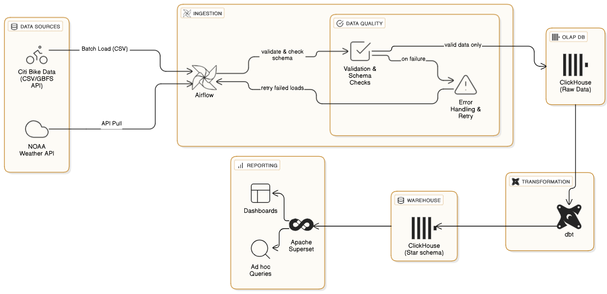
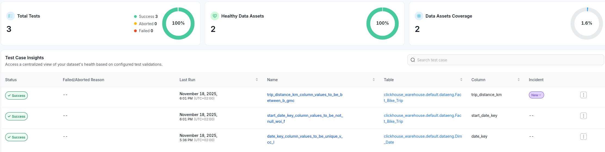
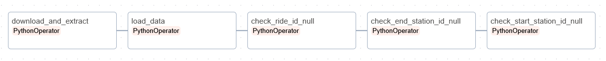
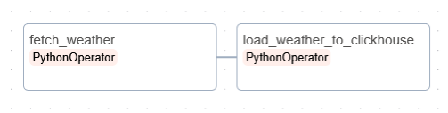
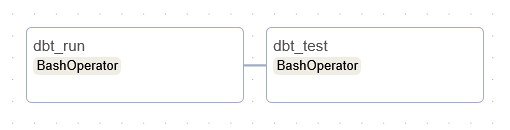

# DataEng2025 – Citi Bike Weather Insights

This repository contains a reproducible data platform that explains how New York City weather patterns shape Citi Bike ridership. The stack bundles ingestion, storage, transformation, and analytics tooling so stakeholders can explore demand drivers with minimal setup.

## Project Overview

- **Goal:** quantify the impact of temperature, precipitation, and wind on Citi Bike usage across seasons and times of day.
- **Primary users:** Citi Bike operations teams, data scientists and analysts, and NYC urban planners/policymakers.
- **Key metrics:** average daily rides, weather-driven demand deltas, seasonal/hourly ridership variability, trip duration by precipitation type, and rider-type responsiveness to weather.

## Solution Architecture

- **Sources:** Monthly Citi Bike trip archives from AWS S3 and hourly weather observations from the Open-Meteo API.
- **Orchestration:** Apache Airflow (LocalExecutor) coordinates ingestion and downstream transformations inside Docker.
- **Storage:** ClickHouse hosts the raw landing tables (`citibike.raw_citibike_trips`, `citibike.raw_weather`) and the analytic marts.
- **Transformations:** dbt models (run inside a dedicated container) curate dimensional tables and a consolidated fact table for analysis-ready querying.
- **Analytics:** Analysts can connect via the ClickHouse HTTP UI or execute prepared SQL in `sql/sample_queries.sql`.

**Architecture diagram:**



### Container Services

| Service | Purpose | Port(s) |
| --- | --- | --- |
| `airflow-webserver`, `airflow-scheduler`, `airflow-db` | Orchestrate and persist Airflow metadata | 8080, 5432 |
| `pgadmin` | Optional web UI for PostgreSQL metadata | 5050 |
| `clickhouse-server` | Columnar warehouse for raw and transformed datasets | 8123 (HTTP), 9001 (native) |
| `dbt` | Runs dbt commands against ClickHouse | n/a (exec via `docker exec`) |

## Local Environment Setup

1. **Clone repo & configure variables**
   ```bash
   cp .env.example .env
   ```
   Default credentials are sufficient for local usage.
2. **Start the stack**
   ```bash
   docker compose up -d
   ```
3. **Create base schemas and raw tables**
   ```bash
   docker exec -it clickhouse-server clickhouse-client --multiquery --queries-file=/sql/01_create_db_and_tables.sql
   ```
4. **Create a Clickhouse user for OpenMetadata and Superset**
   ```bash
   docker exec -it clickhouse-server clickhouse-client --multiquery --queries-file=/sql/task_3_4_roles.sql
   ```
5. **Register ClickHouse as a service in OpenMetadata**

   Create Clickhouse service in OMD UI:

   + Settings -> Services -> Databases
   + Add New Service
   + Service type: `Clickhouse`
   + Service name: e.g. `clickhouse_warehouse`
   + Host and Port: `clickhouse-server:8123`
   + Username: `service_openmetadata`
   + Password: `omd_very_secret_password`
   + Test connection, next, save
6. **Register Superset as a service in OpenMetadata**

   Create Superset service in OMD UI:

   + Settings -> Services -> Dashboards
   + Add New Service
   + Service type: `Superset`
   + Service name: e.g. `Superset`
   + Host and Port: `superset:8088`
   + Username: `admin`
   + Password: `admin`
   + Test connection, next, save
7. **Connect Superset to ClickHouse**
   + In Superset, go to Settings → Database connections
   + Click + Database
   + Choose ClickHouse Connect as the database type
   + Credentials: 
      - Host: `clickhouse-server` (Port 8123, but this should be filled automatically)
      - Username: `service_superset_full`
      - Password: `superset_very_secret_password`
8.  **Confirm services**
   ```bash
   docker compose ps
   ```
   - **Airflow UI:** http://localhost:8080 (default user/password `airflow`/`airflow`)
   - **ClickHouse UI:** http://localhost:8123 (user `admin`)
   - **OpenMetadata:** http://localhost:8585/ (`admin@open-metadata.org`/`admin`)
   - **Superset:** http://localhost:8088/ (`admin`/`admin`)
   - **Minio:** http://localhost:9003/ (`minioadmin`/`minioadmin`)

## User access rights

Create views
```bash
docker exec -it clickhouse-server clickhouse-client --multiquery --queries-file=/sql/task_2_analytical_views.sql
```

Create roles and users
```bash
docker exec -it clickhouse-server clickhouse-client --multiquery --queries-file=/sql/task_2_roles_and_users.sql
```

## OpenMetadata tests




## Operating the Pipeline

### Airflow DAGs (`dags/`)

| DAG | Schedule | Description |
| --- | --- | --- |
| `citibike_monthly_ingest` | `0 0 10 * *` | Downloads newest Citi Bike trip archive, loads CSVs to `citibike.raw_citibike_trips`, and runs basic data quality checks (e.g., missing station IDs). |
| `weather_monthly_ingest` | `0 0 10 * *` | Pulls the prior two months of hourly weather metrics from Open-Meteo and upserts them into `citibike.raw_weather`. |
| `dbt_transforms` | Data-driven | Listens to ClickHouse dataset updates and triggers `dbt run` followed by `dbt test`. |

DAG citibike_monthly_ingest:



DAG weather_monthly_ingest:



DAG DBT transformation:



To backfill or test, trigger DAGs manually from the Airflow UI. The `dbt_transforms` DAG starts automatically once both raw datasets finish loading.

### dbt Models (`dbt_project/models/`)

- `staging/`: Lightweight cleaning layers for trips and weather datasets.
- `marts/Dim_Date` & `Dim_Time`: Calendar and hour-of-day dimensions to support temporal analysis.
- `marts/Dim_Station`: Cleans station metadata and coordinates.
- `marts/Dim_Weather`: Categorises weather metrics (temperature bands, precipitation categories, wind tiers).
- `marts/Fact_Bike_Trip`: Consolidated fact table joining rides with weather signals and station context.

All models target the `citibike` ClickHouse database. Profiles are preconfigured in `dbt_project/profiles.yml` for the containerised runtime.

## Exploring the Data

- **SQL playground:** Navigate to http://localhost:8123/play and query the marts (e.g., `citibike.fact_bike_trip`).
- **Sample queries:** `sql/sample_queries.sql` contains analytical prompts aligned with the KPIs.
- **BI tools:** Connect any ClickHouse-compatible BI client using the HTTP interface (`admin` user, blank password by default).

## Results of analytical queries (limited to 10 rows)

**How do weather conditions impact daily and hourly ridership volumes?**

**Daily**

| full_date   | apparent_temp | precipitation_category | wind_category | total_trips |
|-------------|----------------|------------------------|---------------|-------------|
| 2025-08-31  | Warm           | No Rain                | Breezy        | 846         |
| 2025-08-31  | Warm           | No Rain                | Calm          | 1           |
| 2025-09-01  | Mild           | No Rain                | Breezy        | 31,011      |
| 2025-09-01  | Mild           | No Rain                | Calm          | 20,970      |
| 2025-09-01  | Warm           | No Rain                | Breezy        | 33,662      |
| 2025-09-01  | Warm           | No Rain                | Calm          | 1,758       |
| 2025-09-01  | Warm           | No Rain                | Windy         | 54,460      |
| 2025-09-02  | Mild           | Light Rain             | Breezy        | 2,193       |
| 2025-09-02  | Mild           | No Rain                | Breezy        | 31,823      |
| 2025-09-02  | Mild           | No Rain                | Calm          | 26,398      |

**Hourly**

| full_date   | hour | apparent_temp | precipitation_category | wind_category | hourly_trips |
|-------------|------|----------------|------------------------|---------------|--------------|
| 2025-08-31  | 14   | Warm           | No Rain                | Breezy        | 2            |
| 2025-08-31  | 16   | Warm           | No Rain                | Breezy        | 1            |
| 2025-08-31  | 17   | Warm           | No Rain                | Breezy        | 5            |
| 2025-08-31  | 18   | Warm           | No Rain                | Breezy        | 5            |
| 2025-08-31  | 19   | Warm           | No Rain                | Breezy        | 5            |
| 2025-08-31  | 20   | Warm           | No Rain                | Calm          | 1            |
| 2025-08-31  | 21   | Warm           | No Rain                | Breezy        | 9            |
| 2025-08-31  | 22   | Warm           | No Rain                | Breezy        | 26           |
| 2025-08-31  | 23   | Warm           | No Rain                | Breezy        | 793          |
| 2025-09-01  | 0    | Warm           | No Rain                | Breezy        | 2,841        |


**What is the average trip duration under different precipitation categories?**

| precipitation_category | avg_trip_duration_minutes |
|------------------------|---------------------------|
| No Rain                | 13.29                     |
| Light Rain             | 12.53                     |
| Heavy Rain             | 11.57                     |


**Are certain stations more popular as starting points during adverse weather (e.g., heavy rain) compared to dry hours?**

| station_name         | precipitation_category | trip_count |
|----------------------|------------------------|------------|
| 1 Ave & E 110 St     | No Rain                | 2,021      |
| 1 Ave & E 110 St     | Heavy Rain             | 68         |
| 1 Ave & E 118 St     | No Rain                | 1,589      |
| 1 Ave & E 118 St     | Heavy Rain             | 76         |
| 1 Ave & E 16 St      | No Rain                | 6,483      |
| 1 Ave & E 16 St      | Heavy Rain             | 261        |
| 1 Ave & E 18 St      | No Rain                | 6,218      |
| 1 Ave & E 18 St      | Heavy Rain             | 251        |
| 1 Ave & E 30 St      | No Rain                | 4,163      |
| 1 Ave & E 30 St      | Heavy Rain             | 109        |


**Do casual riders and annual members exhibit different ridership patterns in response to precipitation changes?**

| rider_type | precipitation_category | total_trips | avg_duration_minutes |
|------------|------------------------|-------------|----------------------|
| casual     | No Rain                | 773,275     | 18.9                 |
| casual     | Light Rain             | 202,193     | 17.0                 |
| casual     | Heavy Rain             | 20,317      | 15.7                 |
| member     | No Rain                | 3,218,330   | 11.9                 |
| member     | Light Rain             | 944,249     | 11.6                 |
| member     | Heavy Rain             | 114,345     | 10.8                 |


**What is the peak ridership hour, and how does this peak shift based on season and apparent temperature?**

**Peak ridership hour per season (current dataset includes only the last day of summer):**

| season | peak_hour | total_trips |
|--------|-----------|-------------|
| Fall   | 17        | 507,075     |
| Summer | 23        | 793         |


**Peak ridership hour by apparent temperature category:**

| apparent_temp | peak_hour | total_trips |
|---------------|-----------|-------------|
| Hot           | 18        | 63,984      |
| Mild          | 8         | 236,007     |
| Warm          | 17        | 452,201     |

## Repository Layout

```
├── compose.yml                # Docker Compose stack
├── dags/                      # Airflow DAG definitions
├── dbt_project/               # dbt project (models, profiles, target)
├── sql/                       # DDL and analytical SQL scripts
├── sample_data/               # Optional seed files for local testing
└── docs/                      # DAG diagrams and documentation assets
```

## Troubleshooting

- Airflow permissions reset (only if UI fails to load):
  ```bash
  mkdir -p logs dags plugins
  sudo chown 50000:0 logs dags plugins
  docker compose up airflow-init
  ```
- Verify network access if API calls fail; the weather DAG logs the exact URL for quick manual testing.
- Use `docker compose logs <service>` to inspect container output (e.g., `airflow-webserver`, `clickhouse-server`, `dbt`).

With the stack running, you can iterate on DAGs, dbt models, and analytics confidently while delivering weather-aware insights to Citi Bike stakeholders.
